# Help Desk Frontend

Добро пожаловать в интерфейс **Help Desk** — ваш портал к безупречному опыту поддержки! Этот проект — не просто интерфейс; это лицо революции в управлении заявками. Ожидайте элегантности, скорости и немного драмы при работе с современным, адаптивным интерфейсом, который отлично смотрится на любом устройстве.

## 🚀 Обзор проекта

Frontend Системы Заявок создан для удобства пользователей и команд поддержки. Чистый, интуитивно понятный дизайн и молниеносные отклики сокращают дистанцию между теми, кто нуждается в помощи, и теми, кто её оказывает. Каждый пиксель продуман для ясности и эффективности.

## 🛠️ Технологии

- **HTML, CSS, JavaScript (Vanilla)** — основа веб-интерфейса.
- **GitHub** — контроль версий и совместная работа.
- **Go (Golang) Backend** — фиктивный сервер для данных.
- **Шаблоны** — динамическая подача ассетов для гибкости.

## 🖥️ Скриншоты интерфейса администратора

> _Одна картинка стоит тысячи заявок!_

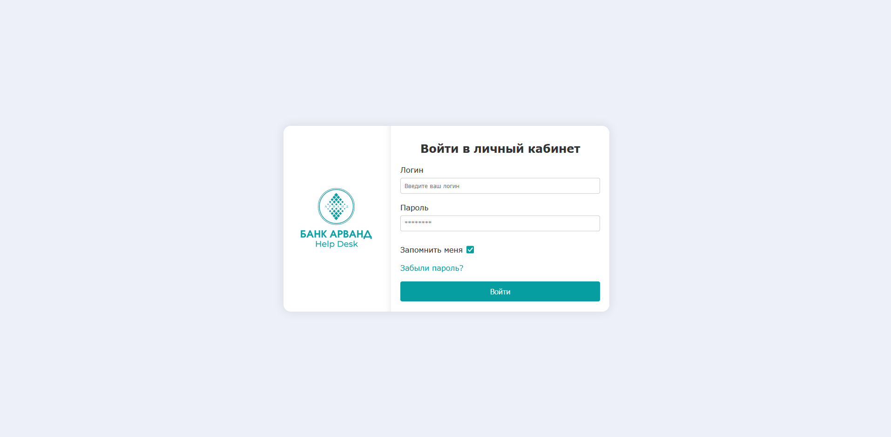
*Страница входа: безопасный доступ к системе поддержки только для авторизированных пользователей.*

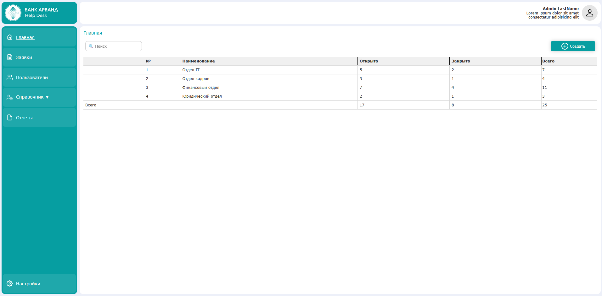
*Главная панель: обзор заявок и их количества.*

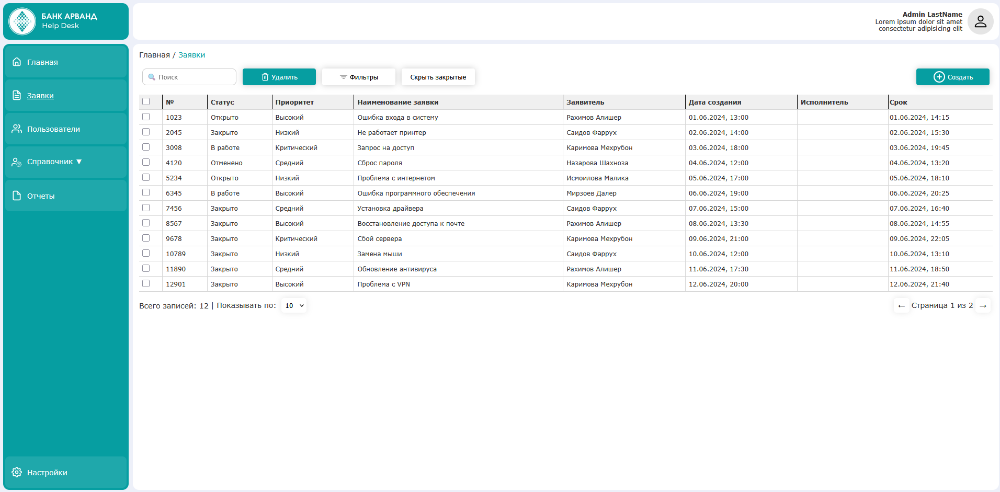
*Просмотр заявок: подробная информация и быстрые изменения.*

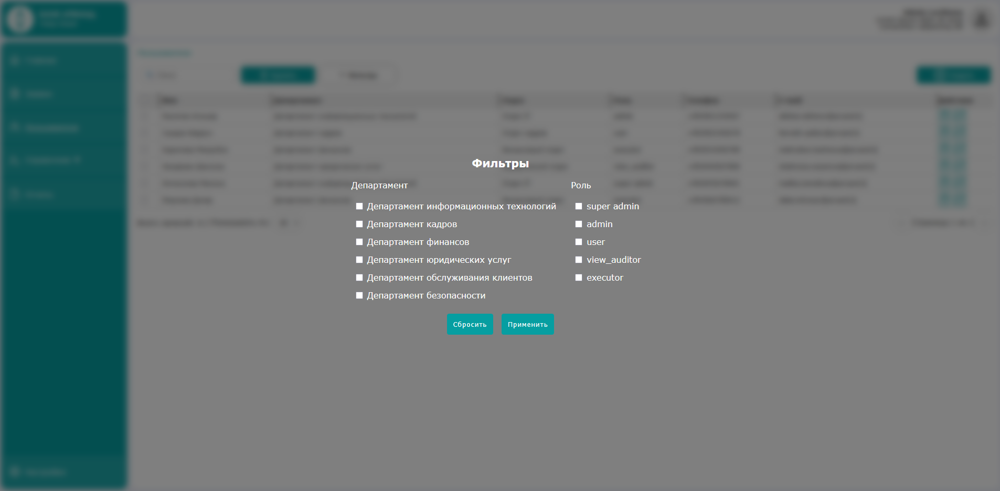
*Панель фильтров: быстро находите нужные заявки.*

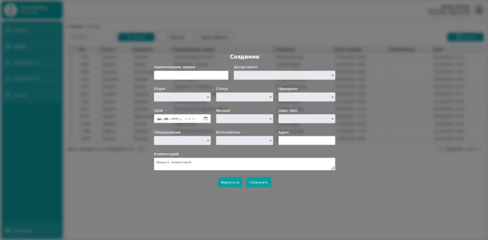
*Форма создания заявки: отправляйте новые обращения легко.*

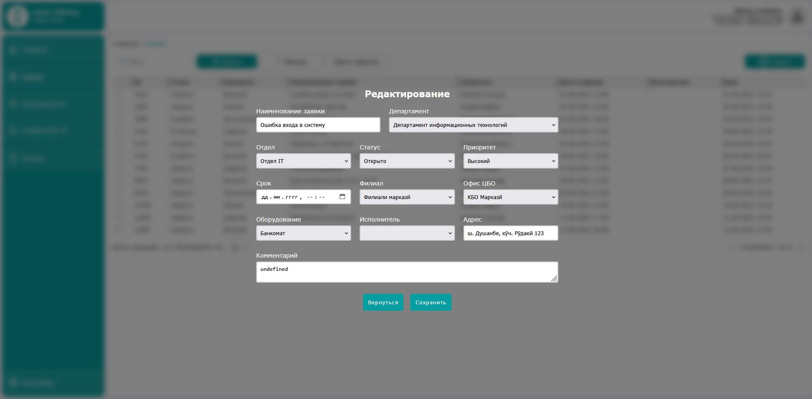
*Редактирование заявки: обновляйте детали и статусы.*

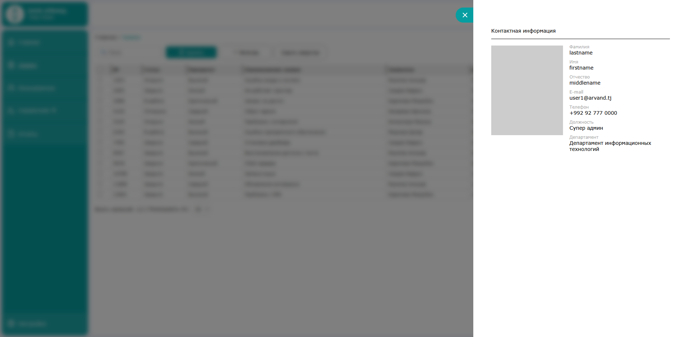
*Информация о пользователе: подробные данные о пользователях.*

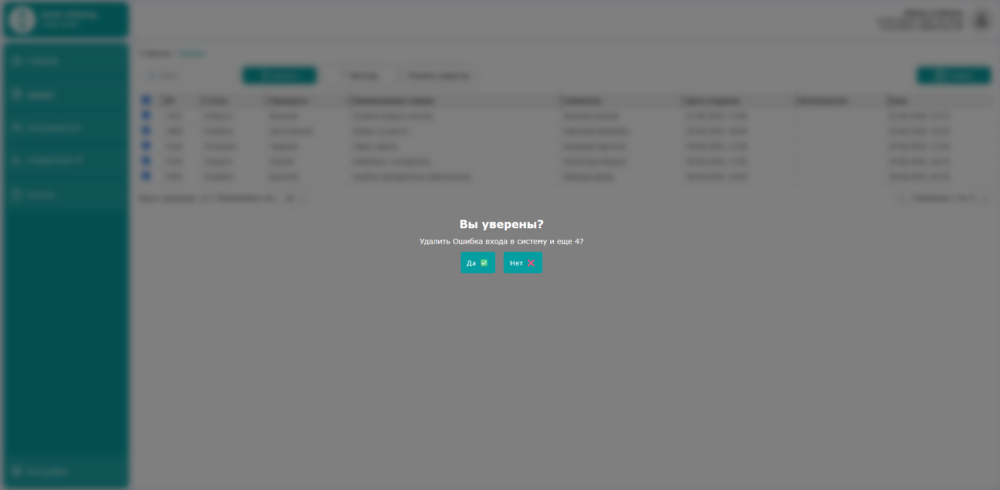
*Окно подтверждения удаления: предотвращение случайной потери данных.*

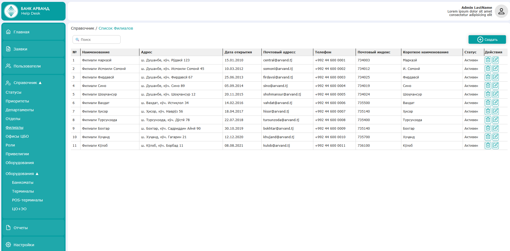
*Страница справочника: управление базой данных.*

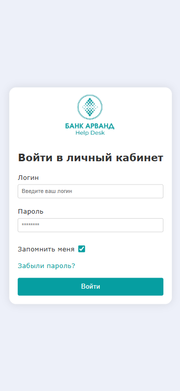
*Мобильная страница входа: удобный доступ с телефона.*

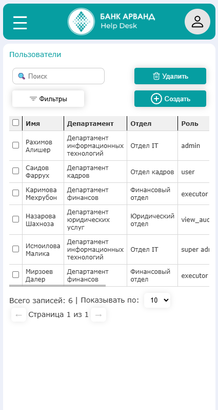
*Пользователи на телефоне: просмотр и управление пользователями на мобильных устройствах.*

## ⚡ Как запустить

Хотите увидеть всё в действии? Запустите сервер командой:

```sh
go run main.go
```

- [Войти как администратор](http://127.0.0.1:8080/admin)
- [Войти как пользователь](http://127.0.0.1:8080/user)

Затем откройте в браузере и оцените работу системы поддержки!

## 📝 Примечания

Этот проект находится в **разработке**. Структура, функции и стек технологий могут меняться по мере развития проекта. Следите за обновлениями!