# Help Desk Frontend

**Help Desk Frontend** — это внутренняя система для управления заявками и задачами в компании. Проект помогает сотрудникам легко создавать, просматривать и обновлять заявки, а также контролировать их статусы в удобном интерфейсе.

## 🛠️ Технологии

- **React** — современный фреймворк для создания пользовательских интерфейсов.
- **HTML, CSS** — оформление и структура страниц.
- **Golang** — тестовый API-сервер для демонстрации данных.
- **Git** — контроль версий.

## 🖥️ Скриншоты интерфейса администратора

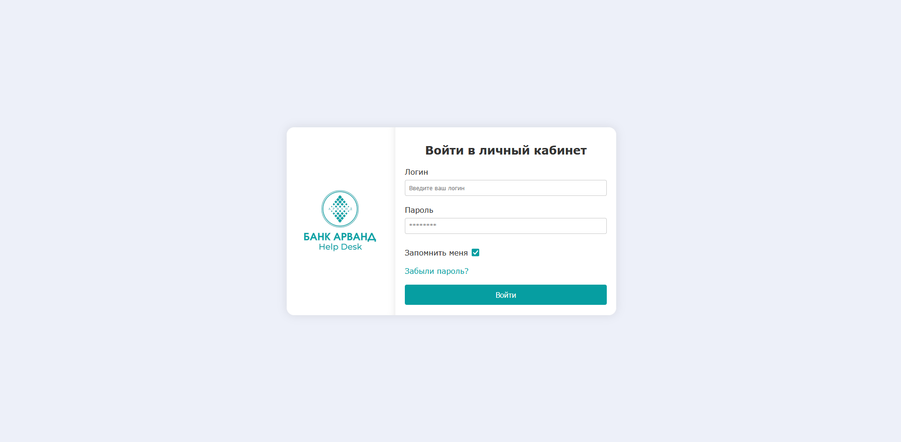  
*Страница входа: безопасный доступ к системе поддержки.*

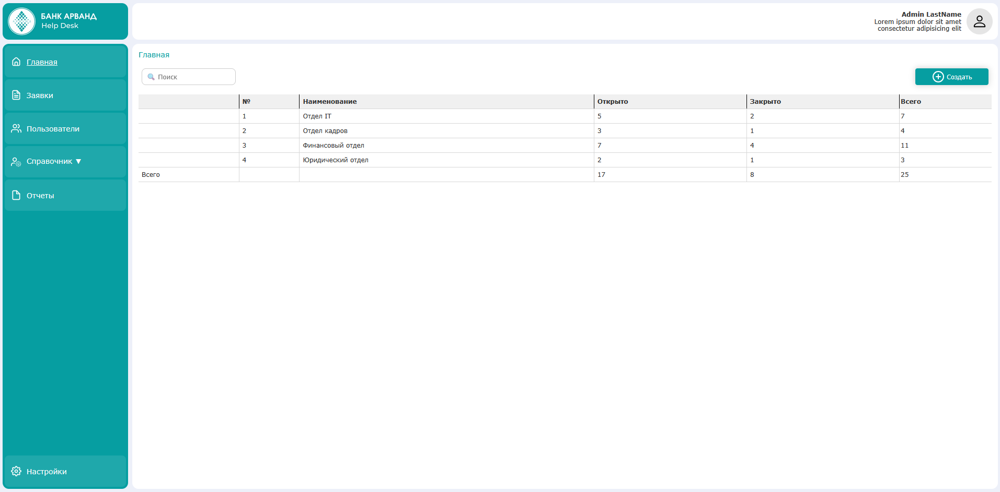  
*Главная панель: обзор заявок.*

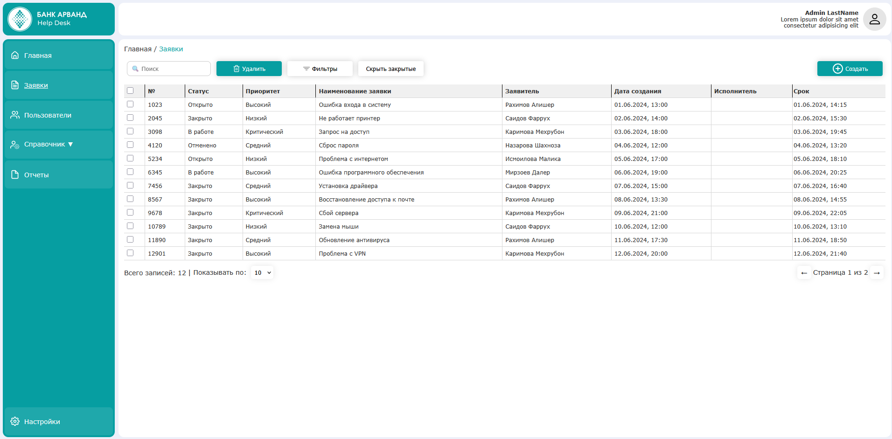  
*Просмотр заявок: подробная информация и быстрые действия.*

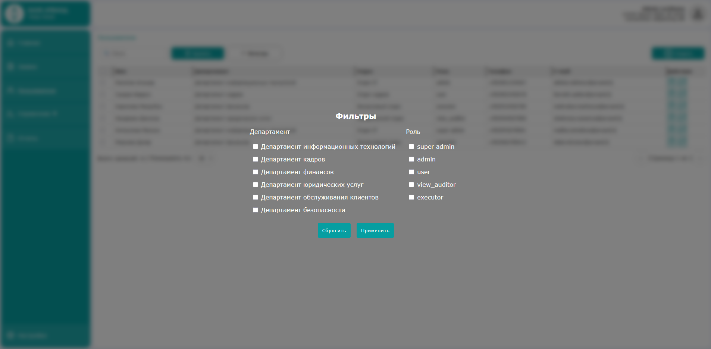  
*Панель фильтров: быстро находите нужное.*

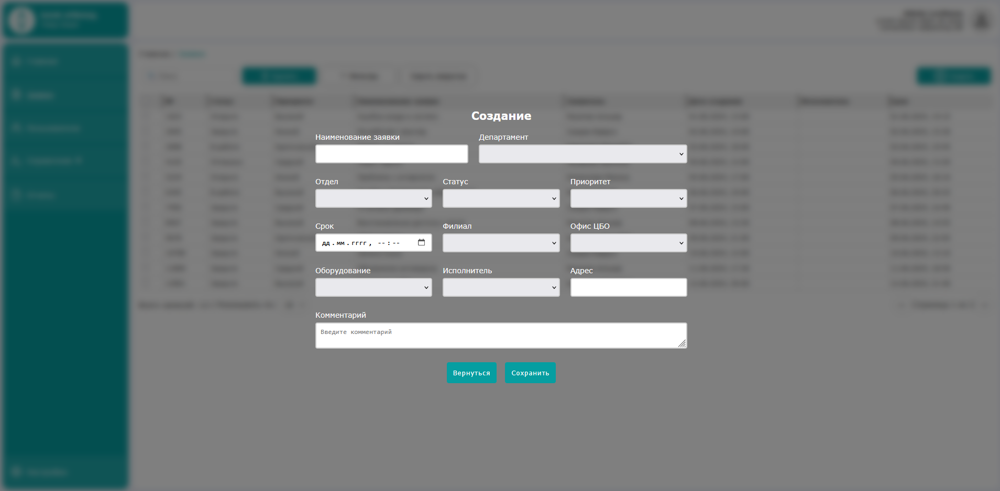  
*Создание новой заявки.*

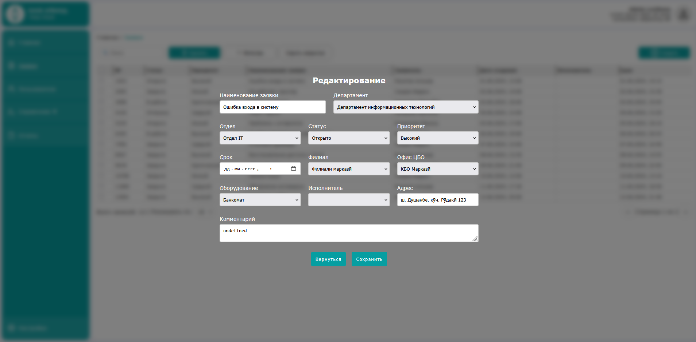  
*Редактирование данных.*

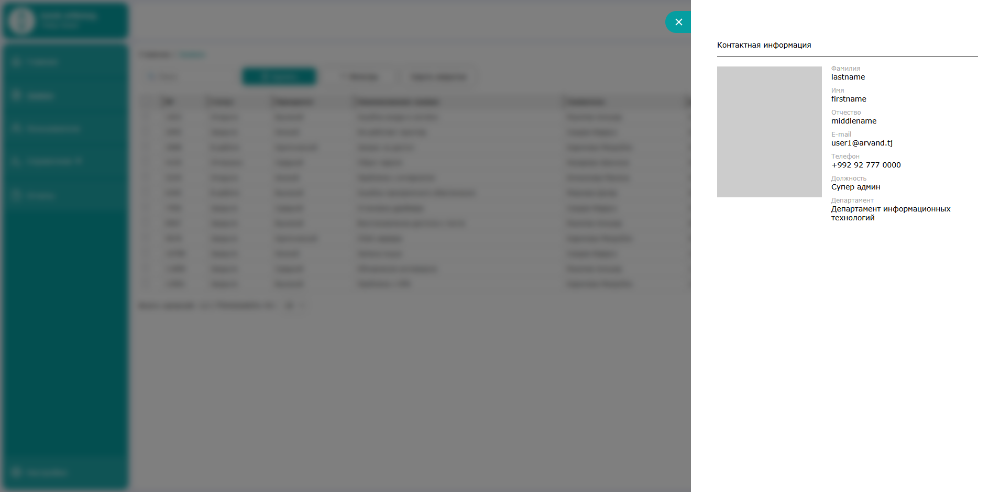  
*Подробные данные о пользователях.*

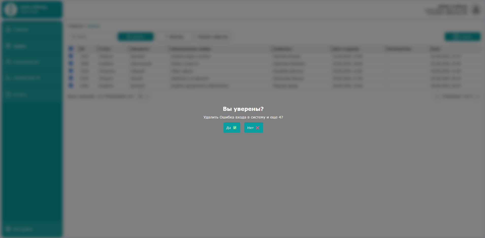  
*Подтверждение удаления.*

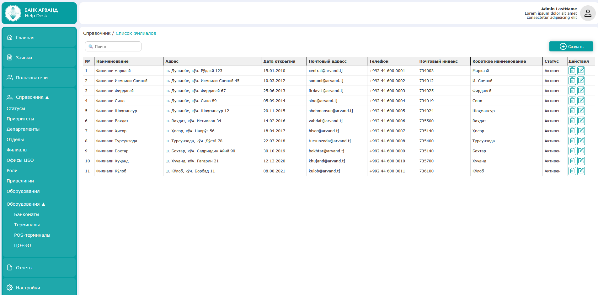  
*Управление справочниками.*

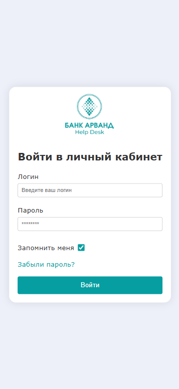  
*Вход с телефона.*

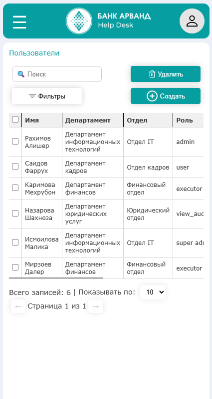  
*Управление пользователями на мобильных устройствах.*

## ⚡ Как запустить проект

Чтобы запустить проект локально, убедитесь, что у вас установлены следующие инструменты:

- 📦 **Node.js** (для запуска React) — [скачать Node.js](https://nodejs.org/)
- 🛠️ **Git** (для работы с репозиторием) — [скачать Git](https://git-scm.com/downloads)

---

### 1️⃣ Склонируйте репозиторий и перейдите в папку проекта

Откройте терминал и выполните:

```bash
git clone https://github.com/siyovush-boboev/help_desk.git
cd help_desk
```

---

### 2️⃣ Укажите адрес сервера

Убедитесь, что бекенд-сервер **запущен**, и в файле `constants.js` указан правильный адрес сервера в переменной `BASE_URL`.  
Например:

```js
const BASE_URL = "http://127.0.0.1:8080";
```

---

### 3️⃣ Установите зависимости и запустите frontend

В терминале выполните команды:

```bash
npm install
npm run dev
```

После запуска фронтенд будет доступен по адресу:

- 🌐 [http://localhost:4040](http://localhost:4040)
- Или по локальному IP-адресу (если доступен)

---

✅ Теперь вы можете использовать интерфейс в браузере.

## 📝 Примечания

Проект находится в **активной разработке**. Возможны изменения в структуре, функционале и используемых технологиях.
